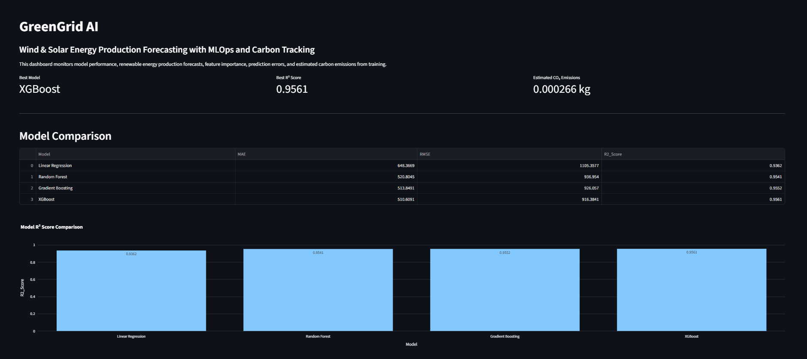
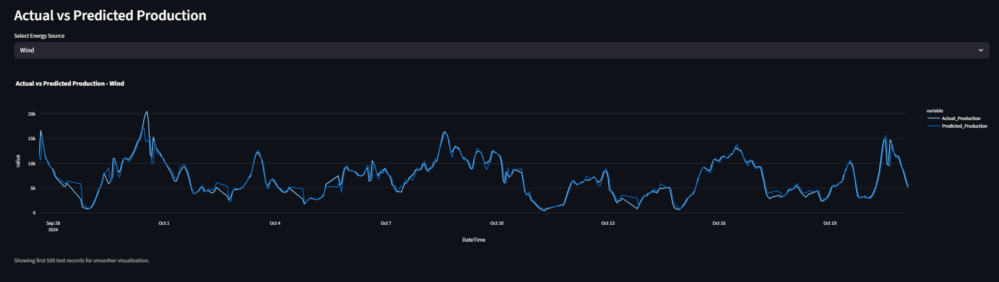
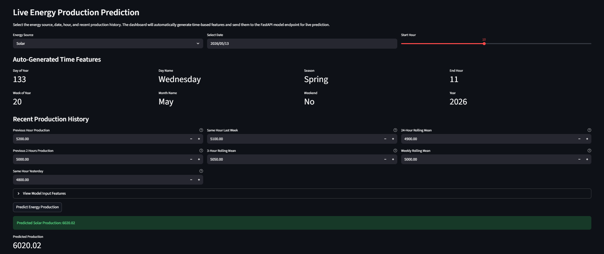
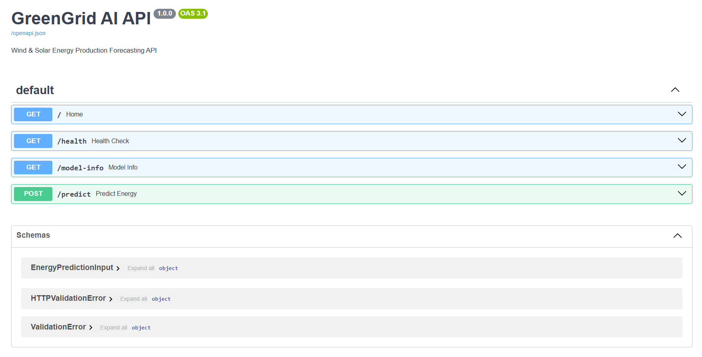
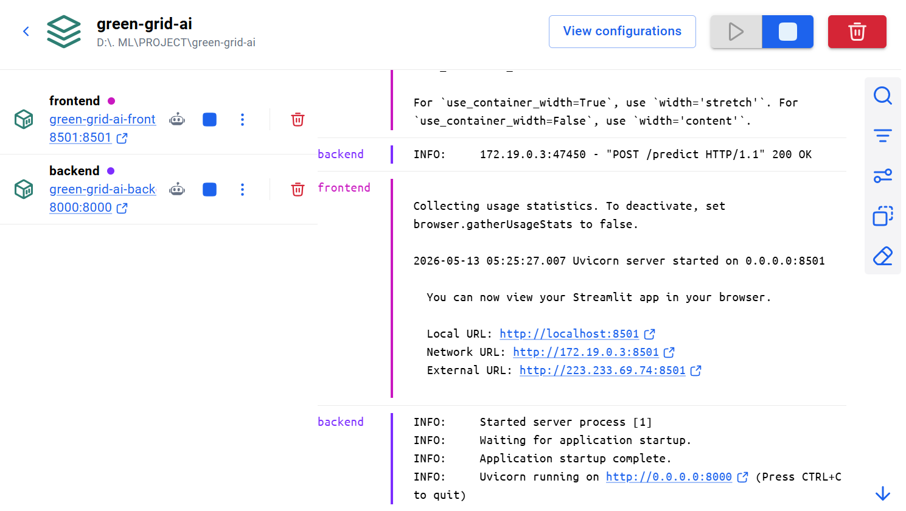

# GreenGrid AI: Wind & Solar Energy Production Forecasting with MLOps and Carbon Tracking

<p align="center">
  
  
  
  
  
</p>

<p align="center">
  <b>Production-ready renewable energy forecasting system using Machine Learning, FastAPI, Streamlit, Docker, Docker Hub, AWS EC2, and CodeCarbon.</b>
</p>

---

## Live Deployment

<p align="center">
  <a href="http://13.206.110.87:8501" target="_blank">
    
  </a>

  <a href="http://13.206.110.87:8000/docs" target="_blank">
    
  </a>

  <a href="https://hub.docker.com/r/sh0hil/green-grid-ai-frontend" target="_blank">
    
  </a>

  <a href="https://hub.docker.com/r/sh0hil/green-grid-ai-backend" target="_blank">
    
  </a>
</p>

---

## Project Overview

GreenGrid AI is an end-to-end Machine Learning and MLOps project that forecasts renewable energy production from wind and solar sources.

The project is designed to demonstrate a complete production-style ML workflow:

- Data preprocessing and feature engineering
- Model training and evaluation
- Best model selection
- Carbon emission tracking using CodeCarbon
- FastAPI backend for model serving
- Streamlit dashboard for visualization and live prediction
- Dockerized frontend and backend services
- Docker Hub image publishing
- AWS EC2 cloud deployment

This project is suitable for demonstrating skills required for Data Scientist, Machine Learning Engineer, AI Engineer, and MLOps Engineer roles.

---

## Problem Statement

Renewable energy generation depends on multiple time-based and environmental factors. Wind and solar production can vary significantly based on the hour of the day, season, source type, and historical production patterns.

The goal of this project is to build a machine learning system that predicts renewable energy production using historical production data, time-based features, lag features, and rolling statistics.

---

## System Architecture

```text
User
 |
 |---> Streamlit Frontend
        |
        |---> FastAPI Backend
                |
                |---> Trained ML Model
                        |
                        |---> Prediction Response
```

### Deployment Architecture

```text
Docker Hub
 |
 |---> sh0hil/green-grid-ai-backend
 |---> sh0hil/green-grid-ai-frontend
              |
              v
AWS EC2 Ubuntu Server
 |
 |---> Backend Container  : Port 8000
 |---> Frontend Container : Port 8501
```

---

## Tech Stack

| Category | Tools |
|---|---|
| Programming Language | Python |
| Data Processing | Pandas, NumPy |
| Machine Learning | Scikit-learn, XGBoost |
| Model Serving | FastAPI, Uvicorn |
| Frontend Dashboard | Streamlit, Plotly |
| Carbon Tracking | CodeCarbon |
| Containerization | Docker |
| Image Registry | Docker Hub |
| Cloud Deployment | AWS EC2 |
| Version Control | Git, GitHub |

---

## Dataset

Dataset used: **Energy Production Dataset**

### Main Columns

- `Date`
- `Start_Hour`
- `End_Hour`
- `Source`
- `Day_of_Year`
- `Day_Name`
- `Month_Name`
- `Season`
- `Production`

### Target Column

```text
Production
```

---

## Feature Engineering

The project creates multiple time-series and production-history features to improve forecasting accuracy.

### Date and Time Features

- `Year`
- `Month`
- `Day`
- `Week_of_Year`
- `is_weekend`

### Cyclical Features

- `hour_sin`
- `hour_cos`
- `day_of_year_sin`
- `day_of_year_cos`

### Lag Features

- `production_lag_1`
- `production_lag_2`
- `production_lag_24`
- `production_lag_168`

### Rolling Features

- `production_rolling_mean_3`
- `production_rolling_mean_24`
- `production_rolling_mean_168`

---

## Models Trained

The following regression models were trained and compared:

- Linear Regression
- Random Forest Regressor
- Gradient Boosting Regressor
- XGBoost Regressor

---

## Best Model and Results

Best model:

```text
XGBoost Regressor
```

Performance:

```text
R² Score: 0.9561
MAE: 510.60
RMSE: 916.38
Estimated CO₂ emissions: 0.000266 kg
```

The XGBoost model performed best because it captures non-linear relationships and handles complex feature interactions effectively.

---

## Feature Importance

Top important features:

```text
production_lag_1
production_rolling_mean_3
production_lag_2
Source_Wind
Source_Solar
hour_cos
Start_Hour
```

The most important predictors are recent production values and rolling averages, showing that historical energy production is highly useful for forecasting future production.

---

## Project Structure

```text
green-grid-ai/
│
├── app/
│   ├── main.py
│   ├── schema.py
│   └── model_service.py
│
├── dashboard/
│   └── app.py
│
├── src/
│   ├── data_loader.py
│   ├── preprocessing.py
│   ├── feature_engineering.py
│   ├── train.py
│   └── model_analysis.py
│
├── data/
│   ├── raw/
│   └── processed/
│
├── models/
│   └── best_model.pkl
│
├── reports/
│   ├── metrics.json
│   ├── emissions.csv
│   ├── predictions.csv
│   └── feature_importance.csv
│
├── assets/
│   ├── dashboard.png
│   ├── actual-vs-predicted.png
│   ├── live-prediction.png
│   ├── fastapi-docs.png
│   └── docker-running.png
│
├── Dockerfile.backend
├── Dockerfile.frontend
├── docker-compose.yml
├── requirements.txt
└── README.md
```

---

## Screenshots

### Streamlit Dashboard



### Actual vs Predicted Production



### Live Prediction



### FastAPI Swagger UI



### Dockerized Application



---

## API Endpoints

### Health Check

```http
GET /health
```

### Model Information

```http
GET /model-info
```

### Prediction Endpoint

```http
POST /predict
```

### API Documentation

```text
http://13.206.110.87:8000/docs
```

---

## Sample Prediction Input

```json
{
  "Start_Hour": 10,
  "End_Hour": 11,
  "Source": "Solar",
  "Day_of_Year": 150,
  "Day_Name": "Friday",
  "Month_Name": "May",
  "Season": "Spring",
  "Year": 2025,
  "Month": 5,
  "Day": 30,
  "Week_of_Year": 22,
  "hour_sin": 0.5,
  "hour_cos": -0.866,
  "day_of_year_sin": 0.53,
  "day_of_year_cos": -0.84,
  "is_weekend": 0,
  "production_lag_1": 5200,
  "production_lag_2": 5000,
  "production_lag_24": 4800,
  "production_lag_168": 5100,
  "production_rolling_mean_3": 5050,
  "production_rolling_mean_24": 4900,
  "production_rolling_mean_168": 5000
}
```

---

## Dashboard Features

The Streamlit dashboard includes:

- Live renewable energy production prediction
- Model performance metrics
- Actual vs predicted production visualization
- Feature importance analysis
- Carbon emission tracking
- Interactive and portfolio-friendly UI

---

## Docker Images

The project uses two Docker images.

### Backend Image

```text
sh0hil/green-grid-ai-backend:latest
```

### Frontend Image

```text
sh0hil/green-grid-ai-frontend:latest
```

---

## Run Locally

### 1. Clone the Repository

```bash
git clone https://github.com/Sh0hil/green-grid-ai.git
cd green-grid-ai
```

If your GitHub repository name is different, replace the repository URL with your actual repo link.

### 2. Create Virtual Environment

```bash
python -m venv venv
```

### 3. Activate Virtual Environment

For Windows PowerShell:

```powershell
venv\Scripts\activate
```

For Linux or macOS:

```bash
source venv/bin/activate
```

### 4. Install Dependencies

```bash
pip install -r requirements.txt
```

### 5. Train the Model

```bash
python main.py
python train_pipeline.py
python analyze_model.py
```

### 6. Run FastAPI Backend

```bash
python -m uvicorn app.main:app --reload
```

FastAPI docs:

```text
http://localhost:8000/docs
```

### 7. Run Streamlit Dashboard

Open a new terminal and run:

```bash
streamlit run dashboard/app.py
```

Dashboard:

```text
http://localhost:8501
```

---

## Run With Docker Compose

Make sure Docker Desktop is running.

```bash
docker compose up --build
```

Open:

```text
Frontend: http://localhost:8501
Backend Docs: http://localhost:8000/docs
```

Stop containers:

```bash
docker compose down
```

---

## AWS EC2 Deployment

The project is deployed on AWS EC2 using Docker images from Docker Hub.

### 1. Pull Docker Images

```bash
docker pull sh0hil/green-grid-ai-backend:latest
docker pull sh0hil/green-grid-ai-frontend:latest
```

### 2. Create Docker Network

```bash
docker network create green-grid-network
```

### 3. Run Backend Container

```bash
docker run -d \
  --name green-grid-ai-backend \
  --network green-grid-network \
  -p 8000:8000 \
  sh0hil/green-grid-ai-backend:latest
```

### 4. Run Frontend Container

```bash
docker run -d \
  --name green-grid-ai-frontend \
  --network green-grid-network \
  -p 8501:8501 \
  -e BACKEND_URL=http://green-grid-ai-backend:8000 \
  sh0hil/green-grid-ai-frontend:latest
```

### 5. Check Running Containers

```bash
docker ps
```

### 6. View Logs

```bash
docker logs green-grid-ai-backend
docker logs green-grid-ai-frontend
```

---

## AWS Security Group Rules

To access the deployed application publicly, the EC2 security group should allow:

| Port | Purpose |
|---|---|
| 22 | SSH |
| 8000 | FastAPI Backend |
| 8501 | Streamlit Frontend |

---

## Green AI Component

This project uses **CodeCarbon** to estimate CO₂ emissions generated during model training.

The goal is not only to build an accurate machine learning model, but also to measure the environmental cost of model training. This makes the project more aligned with sustainable AI and Green AI practices.

---

## Key Learning Outcomes

This project demonstrates:

- End-to-end machine learning workflow
- Time-series feature engineering
- Regression model training and evaluation
- Model serving using FastAPI
- Dashboard development using Streamlit
- Docker containerization
- Docker Hub image publishing
- Cloud deployment on AWS EC2
- Carbon emission tracking using CodeCarbon
- MLOps-style project organization

---

## Future Improvements

- Add MLflow or Weights & Biases for experiment tracking
- Add GitHub Actions CI/CD pipeline
- Add automatic model retraining
- Add database support for prediction logs
- Add authentication for API usage
- Add separate forecasting models for wind and solar
- Deploy behind Nginx with a custom domain
- Add HTTPS using SSL certificate

---

## Resume Bullet

Built **GreenGrid AI**, an end-to-end MLOps project for wind and solar energy production forecasting using XGBoost, FastAPI, Streamlit, Docker, Docker Hub, AWS EC2, and CodeCarbon. Achieved an **R² score of 0.9561** using time-based train-test split, lag features, and rolling averages while tracking model training CO₂ emissions.

---

## Author

**Shohil Khan**

- GitHub: [https://github.com/Sh0hil](https://github.com/Sh0hil)
- Docker Hub: [https://hub.docker.com/u/sh0hil](https://hub.docker.com/u/sh0hil)
- Email: 04shohilkhan@gmail.com
